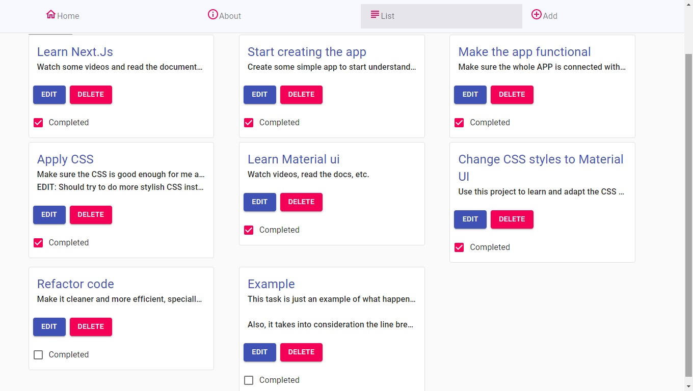
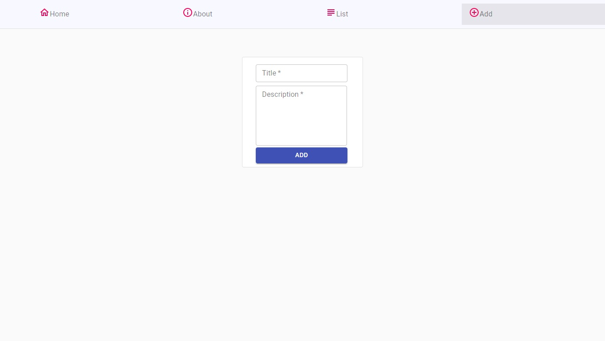

#Task Test

This project was done as of a technical interview involving Next.Js.

## Objetives

- Build a Next.js App withing a week.
- Use a cloud database.
- Deploy to Vercel.

## FEATURES

### Full CRUD

You can add, edit, delete or view a task:

- Task List:

- Add task

- Full task view

## Notes

### Next.JS

- At the moment of doing this project I have never worked with Next.js, meaning that I had to learn it and deploy the app withing a week.

### Material UI

- Material UI was used after the interview as an excuse to learn it and get better with my design skills

## Technologies Used

- Next.JS
- Material UI
- Axios
- MongoDB
- Mongoose
- SweetAlert 2

## CONTRIBUTORS

- [Alan Casella](https://github.com/AlanCasella)